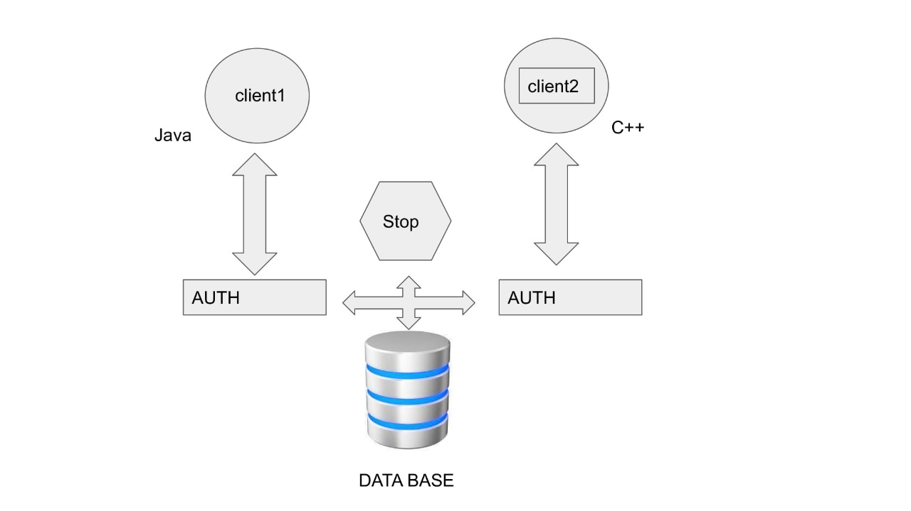

# SChatDb

## Introduction:

- Schat is the chat application built in QT6. QT makes life simple with Graphical User Interfaces and other operations performed by Signals and Slots features.

- Qt also porvides networking like TCP/UDP protocals, Managing databases and many other.
- This also lets the application which can be in any laguage. For example This application is implemented using C++ and Java.
- This Application uses the [Postegresql 9.6](https://www.postgresql.org/about/news/postgresql-96-released-1703/) as server. This provides flexible communication cross plaform devices.

- Postegresql also provides notification system. It automatically notify the clients.
- With [Qt6](https://www.qt.io/product/qt6) and [Postegresql 9.6](https://www.postgresql.org/about/news/postgresql-96-released-1703/) It will be a flexible system to make a client server model.

- Most of the code functionality is based on generating queries and accesing ui elements in Qt.

## Prerequisites:

1. [Qt6 creator and designer](https://www.qt.io/product/qt6)
2. [Postegresql 9.6](https://www.postgresql.org/about/news/postgresql-96-released-1703/)
3. pgAdmin4 (optional)
4. Ubuntu OS

## Building App:

- Using qmake requires Qt6 to be installed in the desktop. Use this snippet of code to build. Build files are already in the BUILD folder.

```
$ qmake SRC/ClientWithDb.pro
```

- With above command it will generate makefile in the output directory.Now, this is time to generate the app with specific configurations. Use the below command in same directory of MakeFile.

```
$ make
```

- After Running the make file go to directory where the executable files are generated. In this BUILD/debug or BUILD/release. These two folders depend on how you use make command to generate.
- Use the below command to run the App. go to specific configuration outputs of make. Use this command to run the app.

```
$ ./ClientWithDb
```

- Sometimes some errors regarding shared libraries will pop up. So, most of the time it is easy to use Qt6 application to open the project file and Build from there. This project file is SRC/ClientWithDb.pro. Make sure to open with Qt application.
- And make sure to replace Hostname from Init function in TaskManager.cpp and test_app.cpp to the Server ip address. Which means the ip address of Postgresql Running.
- Before Building the app make sure of host address. Then make sure Server is running.
- If the build errors are continue to pop up. Use the already build files from BUILD folder. Select Configuration based on needs and proceed Running the app.

## Notes:

- Testcases will run before the app run. This may not affect from running app (Please make sure why testcases are failed).
- Make sure to start server in postegres using pgadmin4 or command line.
- Qt6 sometimes throw error on Qpsql driver not found. So make sure to give the Qt6/plugins/sqldrivers as a environment path variable. So it will detect the drivers.
- Please make sure of server schema should match the app configuration.
- Inorder to avoid problems i also included the server database of postegresql in SRC/database/ folder. This a backup file so, restore in pgadmin4 under a database.

## Hardware Requirements:

1. Operating System (Ubuntu is prefered).
2. Minimum SDD/HDD storage of 250Gb.
3. Minimum 4gb RAM.
4. Minimum 1gb virtual integrated graphics(VRAM).

## Software Architecture:

It's a simple server and client model architecture. The server mainly concerntrates on processing the queries from clients and maintain the information of the user. Postgresql maintains the database and grant access to the client app. Mainly the queries send by the client are taken into account and server do its job of giving the response. There are layers of communication.


The first layer is authentication. It is like a gate to every other layer. Then the remaining layers comes into play. This makes the server and client having a secure connection from other layers. The client applications make queries to do some stuff like fetch contact details, edit ones own profile like changing password, user to user as well as group chat e.t.c. This Database can be hosted by any of the hosting services like Google firebase. As long as the ip address of the database is known to the client application, communication will be carried out between these applications.

## Implementation:

### Overview:

As part of the software engineering skills explaining the implementation is most sensible topic. It shows the whole overiew of the the architecture and Whole work around about the development stage. As part of the Designing and Developing, diagrams like images of ui, Case diagrams and Uml diagrams gives the brief about the development.

## User Interface of C++ application:

Generally if we go with chat applications like Instagram, we can think of the authentication having two boxes as input and a login button. If the user not having the account then login fails and so Signup comes into play.
Below pictures show the login and signup windows.

### Login and Signup Window:


Now, after entering the app the main page of the application will appear. Below image will show the output.

### Main Window:


The list of contacts and Groups are on the left. The chat pane is extended from middle to right with send button.
The chat display should look like the below image.

### Chat Window:


Some other windows like create group window and Profile window.

### Group creation and Edit profile Window:


## Use Case Diagram:

This Diagram explains the functionality and overall behaviour of the application program. The knowlege over the case study can be acquired by positioning ourselves in the place of the application user and admin user.
Use this below depicted scenario as a reference.

The login and logout from the system is maintained by the Cesar as a admin. Alex will login into system and fetch contact googler on right hand side. Now Alex is make a chat request by saying "Hi" to googler. Then ceaser will store the info of the messages and store it. Think Ceaser is mainting a database. Then when ever the googler is online he will be notified with a signal from Cesar. Same Thing goes with the Group chating When ever the group is created with group members.Their respective ids are stored with that group info. So, Whenever a message is invoked into the group by some sender Then the respective group users will get notified. Thanks to Cesar for maintaning such stuff.

This will depict the overall useage of the app. As we go deep into the development we need some other stuff into play like UML diagrams.

## Class UML diagram:

# Future Work
